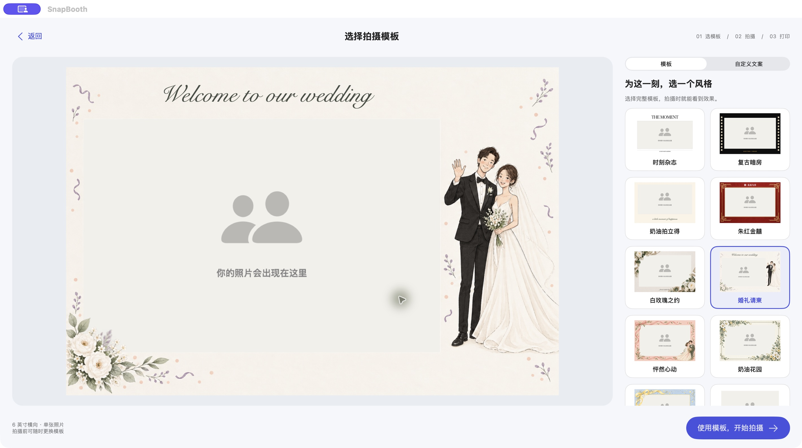
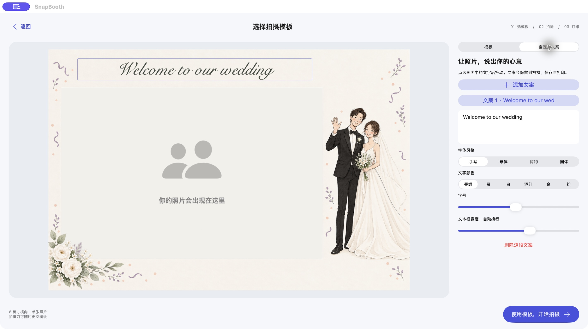
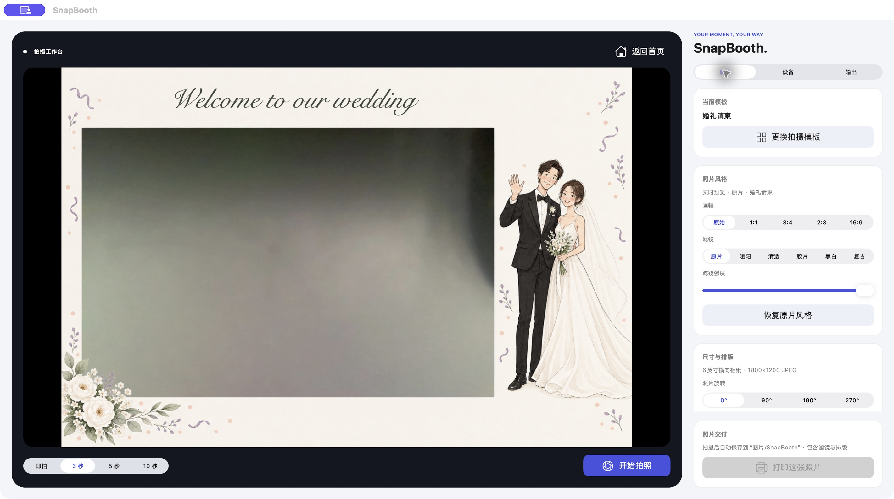

# SnapBooth

SnapBooth 是面向活动现场的现拍现打 App。**iPad 是主平台**：iPad 新增 USB/PTP 直连 EOS R50 V 真快门链路（已在 iPad + R50 V 真机验证拍摄及照片回传），并保留 Canon CCAPI/Wi-Fi 链路，自动下载、保存、排版，再通过系统分享把成片交给米家 App，由用户在米家确认打印。Mac 版仅作为 USB 协议验证、开发调试和应急备用，不作为产品主链路。

## 界面预览

以下为 2026-10-01 截取的 Mac Catalyst 版实际运行界面。iPad 共用主要界面代码，并按屏幕尺寸调整布局；设备连接与打印入口因平台而异。

### 活动首页

婚礼欢迎页支持编辑活动背景和文案。点击“开始拍摄”进入模板选择。


### 拍摄前选择模板

先选择边框再拍照，提供杂志、胶片、拍立得、中式红金、写实花卉及插画等风格。



### 自定义文案

支持添加多段文字、选择字体与颜色、调整字号和文本框宽度，并在预览画面中拖动位置。



### 拍摄工作台

取景时即可看到模板和文字，右侧分为“照片 / 设备 / 输出”设置。支持即拍及 3、5、10 秒倒计时；倒计时使用透明背景的大号白色数字和逐渐缩短的进度圆环。下图为实时取景界面，尚未触发拍摄。



## iPad 主链路状态

- EOS R50 V：已接入 Canon CCAPI。iPad 可通过 HTTP/HTTPS Wi-Fi 实时取景、触发真快门与 AD-E1 热靴闪光，并从存储卡自动下载新增 JPEG；支持佳能 Digest 用户认证，自签名证书仅对所配置的相机主机放行，密码保存在 iPad 钥匙串。UVC 只作为无闪光备用取景。
- 米家桌面照片打印机 2：iPad 默认“米家 App”模式。拍摄后点击“用米家打印”直接弹出分享面板，选择米家（未显示时查看“更多”）。边框和模板在拍摄前设置，实时取景、拍后预览与分享图片使用同一套合成效果。由米家选择匹配的相纸并确认打印，需保留完整图片，避免二次边框或裁切。用户已验证 SnapBooth 分享可以进入米家；分享完成不代表打印完成，取消分享保留当前照片。不提供私有 BLE 直连打印。
- AirPrint：仅作为其他兼容打印机的备选。当前这台二代打印机未在局域网公告 IPP/IPPS 服务。
- iPad 验收标准：所有主功能必须在 iPad 真机完成。Mac Catalyst 构建通过只用于防止备用版回归，不代表 iPad 主链路已完成。

## 当前版本：0.5.4 / build 33

已清理未使用的旧界面、蓝牙直连实验代码和相关蓝牙权限声明。iPad 使用米家分享打印，保留 AirPrint 与模拟打印；Mac 保留 USB 后端。构建缓存和历史安装包已从项目目录移除。

## 历史记录：0.4.1 / build 21

Mac 版现在包含专用的米家 USB 后端，不经过 macOS 打印队列，也不使用系统误配的 DYMO Label Printer 驱动。

- 已在实机识别 `Mijia Instant Photo Printer 2`（USB VID `302c`、PID `3008`）。
- 已验证厂商命令端点、打印端点和 `DC_RASTER` 协议。
- 启动时自动读取打印机型号、固件和告警状态。
- 当前测试机返回型号 `xiaomi.printer.syrup`、固件 `2.1.2_0034`、无告警。
- Mac 默认使用“米家 USB”；自动打印已移除，只能手动确认打印。
- 佳能相机拍摄后，App 在后台完成裁切、滤镜、排版及 300 DPI JPEG 编码，再创建 USB 打印任务。
- 示例图片不会触发自动打印，可用于安全检查排版。
- Build 17 补齐米家照片任务要求的 JPEG 元数据、SHA-1、照片通道与任务状态轮询，并修正数据帧长度必须包含 4 字节任务编号的问题。
- App 只有在设备返回任务完成（`job-state=9`）后才显示“打印完成”；耗材不匹配或进纸暂停会显示失败并提示不要重复发送。
- 米家 USB 路径只支持已通过实物验证的 6 英寸相纸，固定生成横向 `1800×1200` JPEG 并发送 `media-size=5012`、`media-type=2010`；Mac 界面不再提供其他纸型，防止误选耗材导致任务暂停。
- 实机任务 `#15` 已完整上传、打印并返回 `job-state=9`；打印机最终恢复为空闲且无告警。
- Build 19 删除“拍完自动打印”及其全部触发逻辑，米家打印只能由“打印这张照片”按钮手动开始。
- 真实相机拍摄并完成排版后会自动保存 JPEG：Mac 保存到用户的 `图片/SnapBooth` 文件夹，iPad 保存到照片图库；示例图片不会触发自动保存。
- Build 20 使用原创红金婚礼封面作为首页；点击“开始拍摄”后才启动相机。
- 6 英寸相纸和成片默认横向输出为 `1800×1200`；模板与文案在拍摄前设置，点击“打印这张照片”并确认后才发送任务。

USB 命令封装参考了同为 Hannto 设备的公开逆向工程项目 [eastbaymakersclub/pixcut-s1](https://github.com/eastbaymakersclub/pixcut-s1)，并针对本机米家桌面照片打印机 2 的接口和端点进行了实机探测。

## 工作台 UI

流程为「首页 → 模板选择 → 拍摄 → 打印」。首页点击“开始拍摄”先进入独立选择页，选好后点击“使用模板，开始拍摄”才启动相机。拍摄页的“更换拍摄模板”可重新选择，取消选择会保留原样式。

拍摄页将动态相机画面、完整分辨率模板与原生文字分层显示，避免低清实时帧把插画和文案一起缩小；静态装饰只在样式或画布变化时更新。保存和打印仍以完整分辨率合成。

模板编辑页使用 1800×1200 完整分辨率背景预览，文字以原生图层清晰显示。切换到「自定义文案」可添加多段中英文、选择字体和颜色、调整字号与文本框宽度；直接拖动画面中的文字可改变位置。内置婚礼标题同样可编辑或删除，确认后的文案会同步到实时取景、保存、分享及打印。

模板库另外提供五种非插画风格：时刻杂志、复古暗房、奶油拍立得、朱红金囍、白玫瑰之约。前三款使用清晰的图形绘制，后两款使用图片生成的透明纹理素材；默认标题均可编辑、移动和删除。

保留四款原创透明 PNG 插画模板（婚礼请柬、怦然心动、奶油花园、晴空派对），以及可选边框颜色的纯净款。插画素材使用图片生成工具制作，保留原始 alpha 并打包在 Assets.xcassets 中。插画款固定为 6 英寸横向单张，照片在透明窗口内构图；实时预览、保存和输出使用同一渲染路径。纯净款仍支持原有尺寸与排版设置。

拍摄页使用「照片 / 设备 / 输出」三个设置分栏：照片分栏调整画幅、滤镜和排版，设备分栏选择与恢复相机，输出分栏选择打印方式并查看打印机状态。保存提示和打印按钮固定在面板底部，切换分栏无需滚动寻找打印入口。宽窗口左右排列，窄窗口上下排列；首页活动背景和文案仍可单独编辑。

在 Mac 上预览 UI 可直接使用内置摄像头，无需连接佳能相机或打印机。查看界面不会发送打印任务；实际拍摄仍会按原有流程自动保存照片。iPad 分享已合成边框与模板的成片到米家；Mac 点击打印后仅弹出确认，不再进入独立模板编辑页。

## Mac 使用

1. 用 USB/Type-C 将 Canon 相机和米家桌面照片打印机 2 同时连接到 Mac。
2. 打开 `SnapBooth.xcodeproj`，选择 **My Mac (Mac Catalyst)**。
3. 首次构建前安装编译依赖：`brew install libusb gphoto2`。米家辅助程序静态链接 libusb；佳能辅助程序运行时仍依赖 Homebrew 的 libgphoto2。
4. 运行并允许相机权限。
5. 确认设备区显示 Canon 相机，打印区显示“USB 在线 · 无告警”。
6. 装好米家 6 寸相纸和对应色带。
7. 按“开始拍照”；倒计时完成后会自动生成最终 JPEG 并保存到 `图片/SnapBooth`。确认预览后，按“打印这张照片”才会发送打印任务。

“模拟打印”只生成 JPEG，不会出纸；真实打印必须手动按“打印这张照片”。

## iPad 通过 Type-C 连接佳能 R50 V（已验证拍摄及照片回传）

1. 相机切到照片模式，插入存储卡，图像格式选择 JPEG 或 RAW+JPEG。
2. 在相机“通信功能 → 选择 USB 连接应用程序”中选择“照片导入/遥控”；关闭 Wi-Fi。不要选择 UVC 串流或“适用于 iPhone 的佳能应用”。
3. 使用支持数据传输的双端 Type-C 线连接 iPad 与相机，关闭其他占用相机的 App。
4. 在 SnapBooth 点击“开始拍摄”，选择“佳能 USB · Type-C 遥控”，允许系统弹出的相机控制及内容读取权限。
5. 等待连接状态与取景画面，再手动点拍摄。热靴闪光由相机自身设置决定，App 的设备相机闪光开关不控制外置闪光灯。
6. 拍摄后读取本次新增 JPEG 并沿用现有保存和米家分享流程。USB 超时不会自动重拍；先检查相机和存储卡，再通过相机菜单重新连接。“取回”仅尝试本次已识别的待下载对象，不会选择历史照片冒充本次成片。

实现使用 Apple ImageCaptureCore 的公开 PTP 接口；佳能 EOS 操作码和数据布局参考 [libgphoto2 协议定义](https://github.com/gphoto/libgphoto2/blob/master/camlibs/ptp2/ptp.h)，Swift 传输与流程代码独立实现，没有将 libgphoto2 链接进 iPad App。

Build 30：修正会话打开后未等待系统 ready 通知就发送 PTP 的初始化时序；检查相机 PTP 能力。连接状态日志保存在 App 文稿 `USB-connection.log`（限长，不含照片与账号数据）。真机日志已确认 1001 返回成功与 593 字节设备信息。

Build 31：修正 ImageCaptureCore 重新分配 USB 事务编号时被误判为无效响应的问题。使用每次回调的唯一标识与设备身份匹配请求，并保留响应长度、类型、返回码校验。用户已确认真快门触发；照片回传在 Build 33 完成验证。

Build 32：真机日志显示遥控状态下通用文件列表持续为空，新增解析 EOS ObjectAdded/RequestObjectTransfer 事件及系统新增文件回调，使用对象大小分块下载 JPEG 并显示进度；仍保留本次拍摄基线以排除历史照片。

**真机验证：** 2026-09-12，用户在 iPad + EOS R50 V 上确认 Build 33 USB 拍摄与照片回传成功。连续重拍、断线恢复及闪光设置组合尚未逐项记录验收。USB 链路不做模拟器验收。

## iPad 连接佳能 R50 V

1. 在相机进入 `高级连接 → Camera Control API`，连接与 iPad 相同的 Wi-Fi，并保持相机停留在“通信中”。
2. 在 SnapBooth 的相机选择菜单中点“设置佳能 Wi-Fi 地址”。
3. 粘贴相机显示的完整 URL（例如 `https://192.168.1.11/ccapi`），按相机设置填写用户名和密码。
4. 状态显示“真快门/闪光”后再拍摄。成片会保留在相机存储卡，同时自动保存到 iPad 照片图库。

不要从 macOS 系统打印窗口选择当前的 `Mijia Instant_Photo_Printer_2` 队列：本机把它错误识别为 DYMO 标签打印机。SnapBooth 的“米家 USB”模式会绕过该队列。

## 功能

- 自动发现 AVFoundation 可识别的内置或 USB 相机；
- 相机切换、实时预览和 0/3/5/10 秒倒计时；
- 原始、1:1、3:4、2:3、16:9 裁切；
- 暖阳、清透、胶片、黑白、复古滤镜及强度调节；
- 满版、四宫格、双联照片条；
- 1 寸、2 寸证件照精确拼版和裁切线；
- 米家桌面 6 寸纸默认画布 `100 × 148 mm`；
- 保存最终成片、模拟打印、AirPrint 和 Mac 米家 USB 直连。

## 验证

Mac Catalyst：

```sh
DEVELOPER_DIR=/Applications/Xcode.app/Contents/Developer \
xcodebuild -project SnapBooth.xcodeproj -scheme SnapBooth \
  -configuration Debug -destination 'platform=macOS,variant=Mac Catalyst' build
```

iPad Simulator：

```sh
DEVELOPER_DIR=/Applications/Xcode.app/Contents/Developer \
xcodebuild -project SnapBooth.xcodeproj -scheme SnapBooth \
  -configuration Debug -sdk iphonesimulator build
```

排版回归测试：

```sh
DEVELOPER_DIR=/Applications/Xcode.app/Contents/Developer \
xcrun swiftc SnapBooth/StandardPrintGeometry.swift \
  Tests/StandardPrintGeometryTests.swift \
  -o /tmp/snapbooth-geometry-tests && /tmp/snapbooth-geometry-tests
```

## 当前限制

- Canon CCAPI 需要 R50 V 和 iPad 同处一个可互访的 Wi-Fi；相机端账号或密码修改后，需要在 App 中同步更新。
- Mac USB 后端目前只为米家桌面照片打印机 2 的 6 寸照片路径配置。
- iPad 不提供米家 BLE 直连打印；旧探测与认证实验代码已移除。
- 1/2 寸模板只保证物理尺寸和拼版，不代表符合特定证件的拍摄规范。

Build 33：R50 V 真机日志确认拍摄后发出 C1B6（ObjectAddedEx64LFN）事件，补上该事件的照片编号提取，随后查询 ObjectInfo 获取格式和大小，避免沿用旧事件布局；串行写入连接日志，防止回调日志覆盖。用户于 2026-09-12 确认真机拍摄及照片回传成功。
